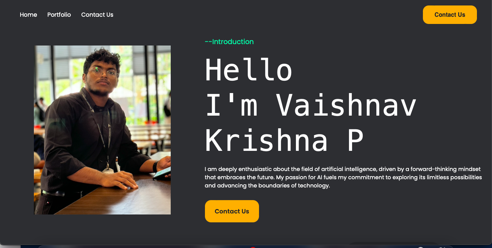

<h3 align="center">BUDDING DATA SCIENTIST FROM INDIA</h3>

 

 
"A PERSON WHO NEVER MADE MISTAKE NEVER TRIED ANYTHING NEW"
 
 🌍  I'm based in **Bangalore, India**
 
 🤝 I’m currently learning **Data Science,Michine Learning, Deep Learning, Full stack devolopment **

 💬 Connect to me [PersonalWebsite Only for Desktop devices](https://Vaishnav2002.pythonanywhere.com)

 ⚡ MORE THAN 30+DATASCIENCE RELATED PROJECTS
 
 ⚡ALWAYS OPEN TO OTHERS
 

 

 
  
  

 

 
<h2 align="center">⚒️ Languages-Frameworks-Tools ⚒️</h2>
 

    
 

<h2 align="center">⚡ Stats ⚡</h2>
 

   
   
   

 

<h2 align="center"> 📌 Portfolio Website 📌 </h2>

[![][black-shield]][black]

[black]: https://Vaishnav2002.pythonanywhere.com
[black-shield]: https://img.shields.io/badge/PORTFOLIO-WEBSITE-blue?style=for-the-badge

 

  <h2>🐍 My Contributions 🐍</h2>
   
  
  
     

