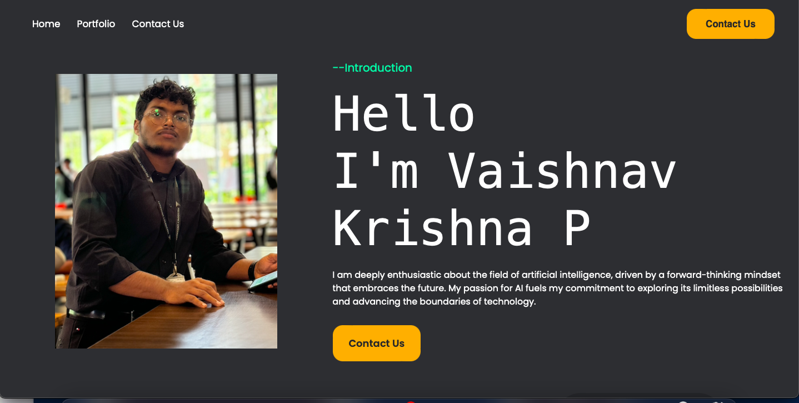
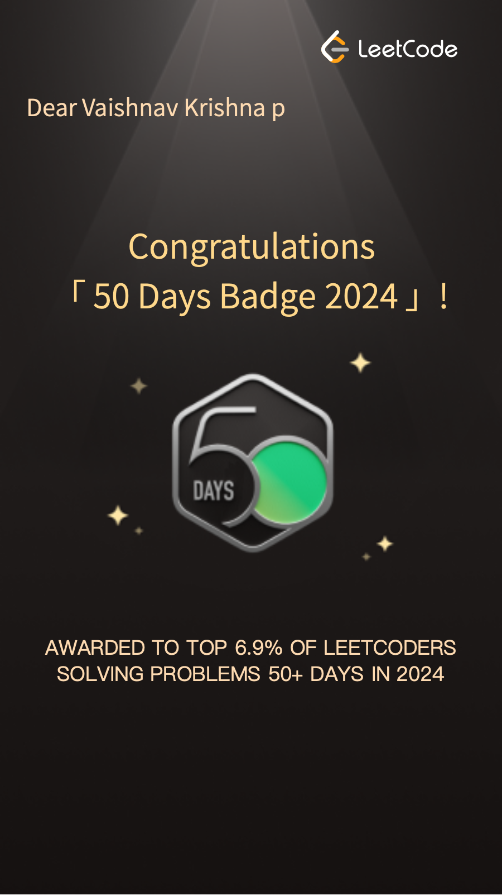
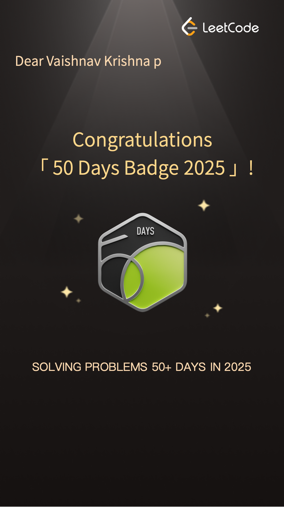
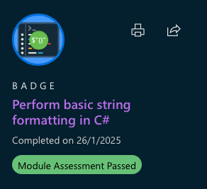
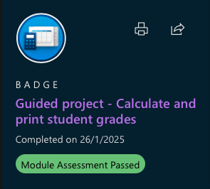
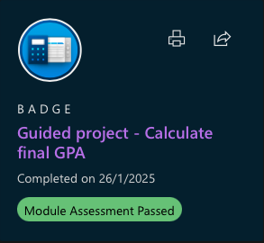
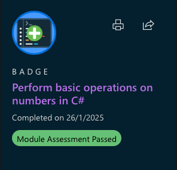
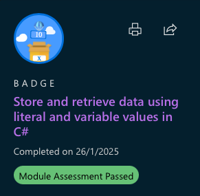
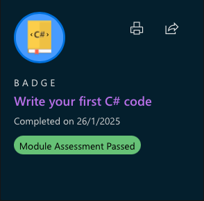

<h3 align="center">BUDDING DATA SCIENTIST FROM INDIA</h3>

 

 
"A PERSON WHO NEVER MADE MISTAKE NEVER TRIED ANYTHING NEW"
 
 🌍  I'm based in **Bangalore, India**
 
 🤝 I’m currently learning **Data Science, Machine Learning, Deep Learning, Full stack development**

 💬 Connect to me [PersonalWebsite](https://vaishnavgithuber.github.io/Portfolio2.0/)

 ⚡ MORE THAN 30+ DATASCIENCE RELATED PROJECTS
 
 ⚡ALWAYS OPEN TO OTHERS
 

 

 
  
  

<h2 align="center">💻 LeetCode Stats 💻</h2>
 

  
<b>📈 170+ Problems Solved</b>

  
  

<h2 align="center">🏅 Badges 🏅</h2>
 

  
  
  
  
  
  

<h2 align="center">⚒️ Languages-Frameworks-Tools ⚒️</h2>
 

    
     

<h2 align="center">⚡ Stats ⚡</h2>
 

   
   
   

  <h2>🐍 My Contributions 🐍</h2>
   
  
  
     

